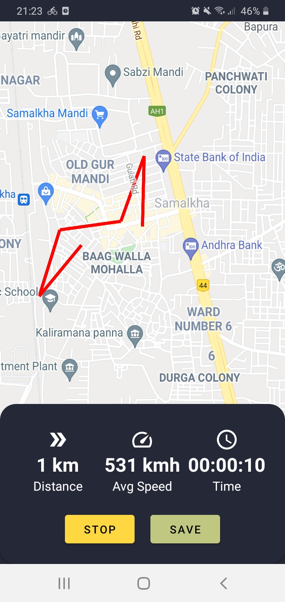
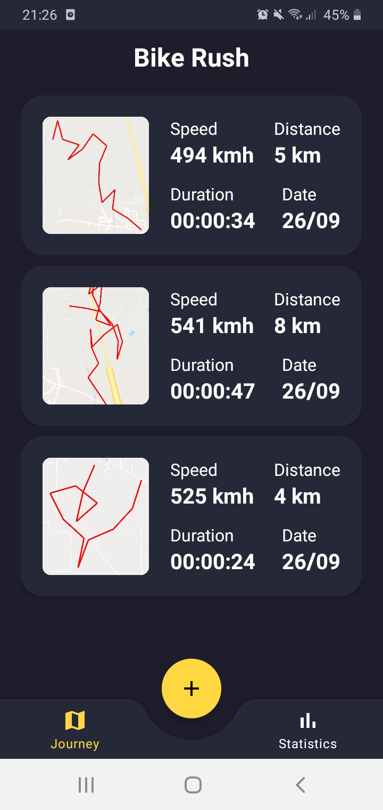
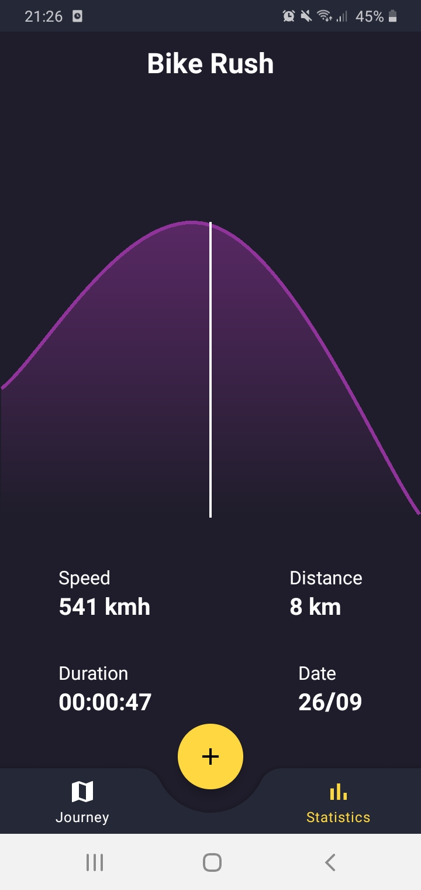
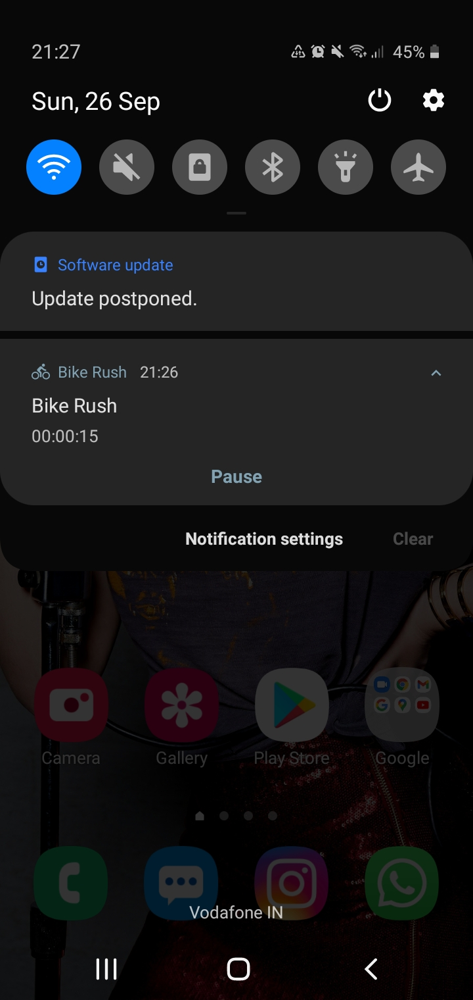
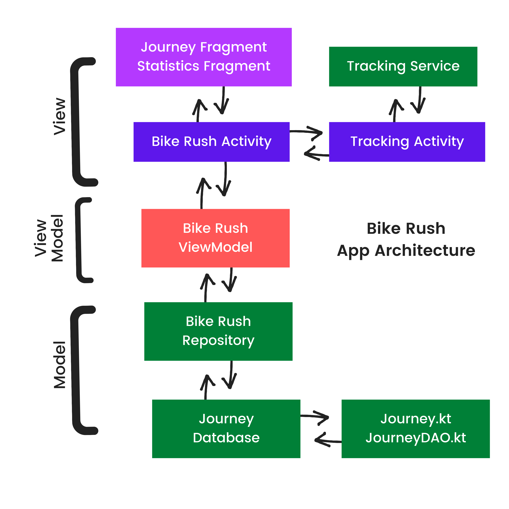

# Bike Rush
**Bike Rush** is an android app that uses **Google Maps API and SDK** to track a user's location and calculate the total distance travelled by him or her along with time and average speed. 
  
The app will keep tracking the user even when it is closed or screen is turned off. Additionally, the app also shows an interactive Distance-Time graph of a user's journey. 

**Note:- To test the app, I have used Fake GPS Location Spoofer to quickly change my location from one place to another. This is the reason why speed is shown too high in the above app screenshots.**

### Project Purpose
The purpose of this project is to demonstrate how can a person:
* Use Google Maps API and Android Location Services to get the current location of user and draw it on the map.
* Calculate the total distance, time and average speed of the user in his or her overall journey and store it in database.
* Start a foreground service and update the notification every second to notify the user about total journey tracking time elapsed.
* Use Interactive Line Charts to display the statistics of total number of journeys made by the user.
 

Below I have explained the flow of app. Moreover, I have also commented what I am doing in a particular function or class in the app's source code so that one can easily understand it. In any case if you do not understand something, feel free to contact me.

### Project Setup
#### Adding Dependencies
Before we get started, we need to add the following dependencies to your build.gradle app

* [Google Maps Location Services](https://developers.google.com/maps/documentation/android-sdk/location) - This dependency will let us use Google Maps SDK in our app using our API Key.
* [Room Persistance Library](https://developer.android.com/training/data-storage/room) - This library provides an abstraction over SQLite and makes it a lot simpler to save and fetch data from a device's database.
* [Coroutines](https://developer.android.com/kotlin/coroutines) - Coroutines are used to perform two or more tasks parallely or asynchronously. They are very useful when you need to load data from cloud into your app.
* [Dagger Hilt](https://developer.android.com/training/dependency-injection/hilt-android) - Dagger Hilt is a library that provides an abstraction over Dagger. We will use this library to implement Dependency Injection in our app.
* [Glide](https://github.com/bumptech/glide) - Glide is an image loading library. It makes it really easy to load images from cloud into our app. Moreover, we can also set placeholder and error images and also change the quality of images.
* [Easy Permissions](https://github.com/googlesamples/easypermissions) - This dependency lets us easily check whether the user has provided access to a certain permission or not and also lets us manage when to show permission rationale and open android permission settings.
* [Architectural Components](https://developer.android.com/topic/architecture) - To use Viewmodel in our app, we will use this library.
* [Navigation Component](https://developer.android.com/guide/navigation/navigation-getting-started) - This is the Android's library that makes it really easy to navigate from one fragment to another.
* [Google Material Design](https://material.io/develop/android) - This library provides a huge collection of ready to use beautiful UI components that are much better than Android's default UI components.
* [Timber](https://github.com/JakeWharton/timber) - Timber is a library that helps you in debugging your code by logging messages at different parts of your code. It is much more efficient than the default Log() method.

### App Architecture

I have used MVVM architecture in this app. The flow of the app is as follows:

1. Journey.kt 
This class defines data about a single journey that user will make including details such as distance travelled, duration of journey, average speed, date created and image of journey.

2. JournetDAO.kt 
This class defines the operations we will perform using Journey.kt class such as insertion, deletion and fetching of data from database.

3. Journey Database 
This class creates the database of our journey into the device.

4. Bike Rush Repository  
Purpose of a repository is to collect data from database and any cloud storage. In BikeRushRepository.kt, we will simply take the data from JourneyDatabase.kt.

5. Bike Rush Viewmodel  
This class will launch the coroutines and call the functions inside BikeRushRepository.kt.

6. Bike Rush Activity  
This is a simple activity to hold all of our fragments.

7. Journey Fragment  
This fragment will display list of all of our journeys in the android database.

8. Statistics Fragment  
This fragment will display the interactive line chart using all the journey related data present inside android database.

9. Tracking Activity  
This class will display the map, draw the track of user on it and also display the realtime values of speed, distance and time.

10. Tracking Service  
This service will make the actual requests for the user's location, make the calculations and monitor the changes of speed, distance, time and also display the notification.

### Helper Classes
These are some of the classes I created to optimize my code a little more and perform some more tasks:
1. TrackingUtility.kt  
This class contains the functions to check the location permission, convert total number of seconds to hh:mm:ss string format and calculate the total length of path travelled by the user.

### Dagger Hilt related files
1. AppModule.kt  
This file contains the objects we only need as long as our application lives.

2. ServiceModule.kt  
This file contains the objects we only need as long as our service lives.

3. BikeRushApplication.kt  
This file provides Application Context and Timber Debug Instance to all our functions.

### Other important files
1. Constants.kt  
This file contains all the constant variables we require in our app such as Notification IDs, Path color and thickness, Google map zoom, etc.

2. Converters.kt  
Android Room database cannot store image as bitmap so in this class, we have converted image to byte array to be stored in database and also convert byte array back to a bitmap to be displayed in the image view.

3. JourneyAdapter.kt  
This class defines how many journey items are to be displayed in JourneyFragment.kt, how would they look like and how to assign data such as image and text values from the android database to those journey layout items.

### Google Maps API setup
This is really simple. All you need to do is:
1. Go to [Google Cloud Platform](https://console.cloud.google.com/) and create an account.
2. Create a project for Android SDK and get your Google maps key.
3. Then in strings.xml, paste the API key in the following format:

&lt;string name="google_maps_key"&gt;*Paste your API Key here*&lt;/string&gt;

Once you do this, you are all set to use google maps in your app :)

**Note:- For security purposes, I haven't added strings.xml file in this github repository. But you can easily clone this project, go to res folder, and inside it, go to values and create strings.xml and paste your API key there.**

## Contact
For any queries, you can mail me at developerishant710@gmail.com
